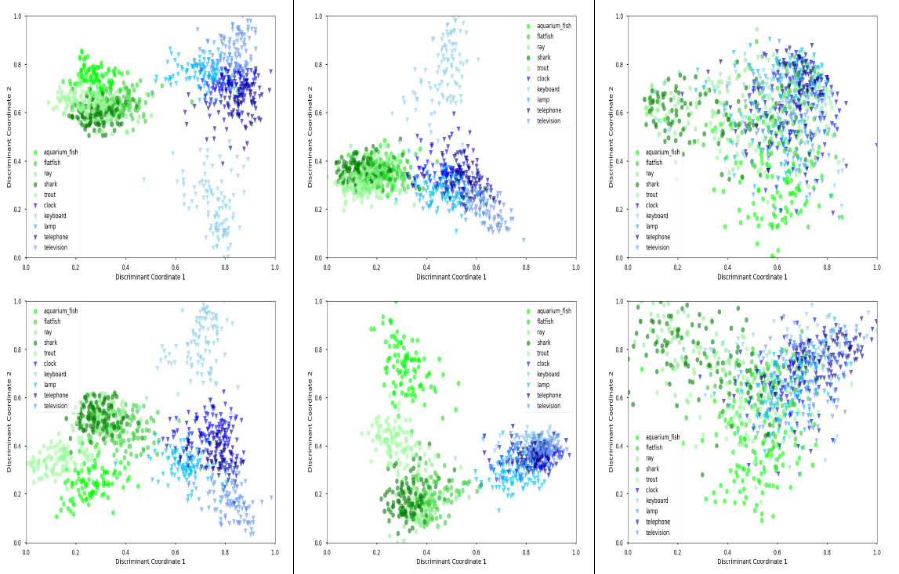

# Leveraging the class hierarchy in deep learning
## Under review at AISTATS2023

*⚡ This is preliminary anonymous directory. The code will be improved and moved to a public directory under acceptance. A notebook will be also published for running Linear Discriminant Analysis on representations ⚡*




## Abstract 

> In recent years, deep learning has increasingly leveraged massive amounts of images to obtain remarkable results. When data availability is limited, the implementation of complex models with many parameters requires the exploitation of a priori knowledge. We propose here a classification method aiming at integrating such knowledge of the classes, expressed in the form of a hierarchy, in which the classes are organized according to a tree structure expressing the inclusion of classes in superclasses. We propose a loss function that incorporates this hierarchy, by stipulating that each example belongs not only to a class but also to all superclasses that contain it. This loss function is associated with an appropriate regularization of the coefficients of the last softmax layer of the network. These two components of the learning algorithm can be utilized in any feedforward architecture with a softmax output layer. We conduct an experimental study performed on three state-of-the-art networks (InceptionV3, ResNet50, and ViT-B16) and three benchmarks (CIFAR100, ImageNet-1K, and FGVC-Aircraft). We vary the size of the training sets from small to medium and show an almost systematic improvement in performance. Our analyses show that these performance gains are related to a representation of the last layer that is more adapted to the class hierarchy, with similarities between representations that reflect similarities between classes. We finally apply our approach to the real problem that originally motivated this study, namely the classification of femur fractures. On this dataset with a large class imbalance, our method likewise achieves notable accuracy improvements.  

## Dependencies
A Conda environment is available in the folder env. To import it type:
```
conda env create -f hierarchical-nn-env.yml
```

## Experiment
To reproduce the experiment, ImageNet-1K, CIFAR100 and FGVC-Aircraft should be download from the official release and re-organized into train and test.  
1. [ImageNet-1K](https://www.image-net.org/challenges/LSVRC/index.php)  
2. [CIFAR-100](https://www.cs.toronto.edu/~kriz/cifar.html)  
3. [FGVC-Aircraft](https://www.robots.ox.ac.uk/~vgg/data/fgvc-aircraft/)    

The tree hierarchies for the tree dataset are available in the folder ```Trees```.  

Run ```train.py``` to train a network and ```test.py``` to test it. The required arguments are:

```-hl```: Using loss hierarchical or not  
```-m```: Inception, ResNet or ViT  
```-d```: imagenet, fgvc, cifar 
```-r```: Reduction factor  
```-tp```: Path to the tree file  
```-dp```: Path to the dataset folder containing train and test folders  
```-op```: Path to folder where to save models  
```-lp```: Path to folder where to save logs  

While the non-required argument are:  
```-b```: Batch size, default=64  
```-e```: Number of epochs, default=30  
```-lr```: Learning rate, default=0.001  
```-wd```: Weight decay, default=0.1  
```-pm```: Weather to plot or not matrices, default=False  

